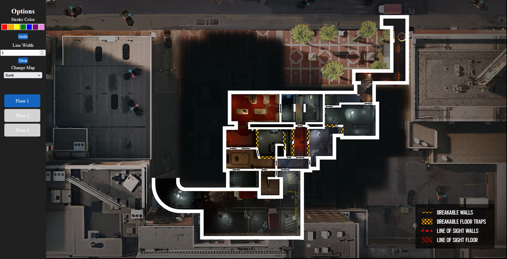

# Project Overview
This interactive webpage is built using HTML/CSS and plain JavaScript. The main functionality is drawing over an image of a map blueprint via images pulled from Ubisoft.com embedded into an HTML canvas element. It offers a basic UI that allows the user to change the color and line width of the pen, clear the canvas, change the map blueprint, and select which floor to view on any given map. This is a solo personal project that I created to help me and my friends better visualize and coordinate plans in Rainbow Six Siege.

# How to Use It
This webpage may be locally hosted, or hosted on a Heroku cloud server to accommodate multiple simultaneous clients with real-time updates to the canvas.

## Hosting Locally
1. Download the whole project as a ZIP file.
2. Extract the contents of the ZIP file.
3. Navigate to R6StrategyDrawingApp-main/public.
4. Launch index.html.

## Hosting on Heroku
Assuming that you already have an application registered for Herkou and you have downloaded and uncompressed the project:
1. Navigate to R6StrategyDrawingApp-main/public.
2. Edit index.js.
3. Change the connection string in line 35 (const socket = new WebSocket("Your Connection String Here");).
4. Open a web browser and past your connection string into the search bar.

# Preview Image

